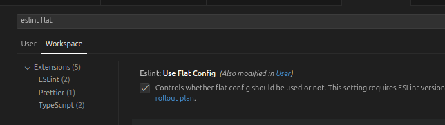

# Prettier and ESlint config

This package extends (and updates) [Airbnb's JavaScript style guide](https://github.com/airbnb/javascript), integrates with [TypeScript ESLint](https://typescript-eslint.io/), and includes a Prettier configuration for consistent code formatting.

## Contributions

- You can check legacy ESLint rules at [https://eslint.org/docs/latest/rules](https://eslint.org/docs/latest/rules). This page also indicates whether a rule has been replaced or deprecated.
- eslint-plugin-node has been forked and is now maintained as [eslint-plugin-n](https://github.com/eslint-community/eslint-plugin-n/tree/master/docs/rules)
- Style formatting use [eslint.style](https://eslint.style/rules)
- Make sure to use explicit file extensions in import statements (e.g., `import rules from './rules/index.js'`). 
ESLint follows strict ESM resolution rules and will fail if the extension is omitted, even if the target is an `index.js` file.

## Inspect tool for ESLint

- You can launch the [ESLint Config Inspector](https://github.com/eslint/config-inspector) using either of the following commands:

```bash
npm run inspect
```

This tool provides a visual overview of all configured rules and options. ([Learn more here](./inspector.md)).

## Installation and usage

### ESlint

```bash
npm i -D eslint@^9.0.0
```
Then create an `eslint.config.mjs` file in the root of your project:

```js
import rules from "not-airbnb-eslint-config";

export default [
  ...rules,
  // Add your custom configs below
];
```

### Prettier

This package uses `prettier.config.js` with ESM syntax (`export default`). Make sure you're using Prettier version **>=3.0.0**. You can install it with:

```bash
npm i -D prettier@^3.0.0
```

Then you just need to create a file prettier.config.js on your root directory

```js
export { default } from 'not-airbnb-eslint-config/prettier';
```

If you want to extend the base config with your own rules, do the following:

```js
import baseConfig from 'not-airbnb-eslint-config/prettier';

export default {
  ...baseConfig,
  // Add your custom rules below
  semi: true,
  printWidth: 100,
};
```

## Usage on VSCode

### Enable Flat Config

The ESLint server may still be expecting the legacy config file format. To enable support for Flat Config, open the settings panel, search for `eslint flat`, and check the **"ESLint: Use Flat Config"** option.  
We **strongly recommend enabling this at the workspace level**, especially during the transition from ESLint 8.



### Setting Prettier as the Default Formatter (VS Code)

1. Open your **workspace settings** (`.vscode/settings.json`), or in the Command Palette: ">Preferences: Open Workspace Settings (JSON)"

2. Add the following:

```json
{
  "editor.defaultFormatter": "esbenp.prettier-vscode",
  "editor.formatOnSave": true
}
```

3. Optional: restrict it to certain languages (like TypeScript):

```json
{
  "[typescript]": {
    "editor.defaultFormatter": "esbenp.prettier-vscode"
  },
  "[typescriptreact]": {
    "editor.defaultFormatter": "esbenp.prettier-vscode"
  }
}
```

## Individual rule sets

You can import named configurations from a single entry point

```ts
import {
  bestPractices,
  errors,
  es6,
  imports,
  node,
  style,
  strict,
  variables,
  react,
  reactA11y,
  reactHooks,
} from "not-airbnb-eslint-config";
```

### Note about `javascript/style`

The `javascript/style` rule set is not included in the default export because formatting is handled by Prettier. If you want to enable style rules, you can import `style` explicitly via the named exports and compose your config. For example:

```js
import rules, { style } from "not-airbnb-eslint-config";

export default [
  ...rules,
  style,
];
```
