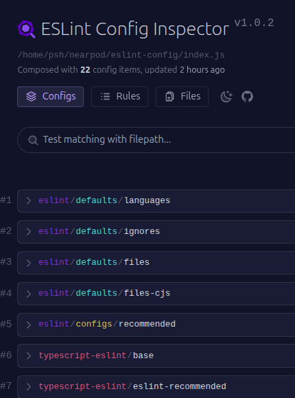
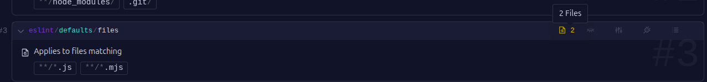
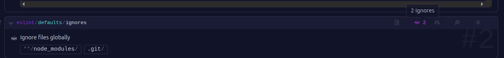
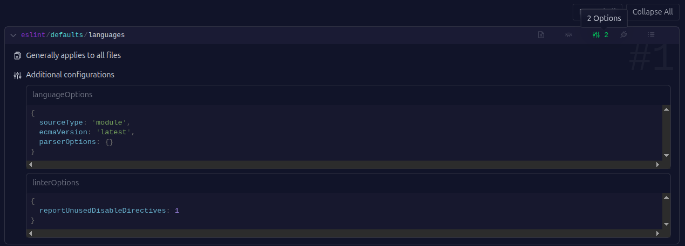
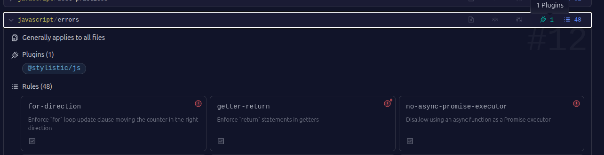
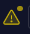
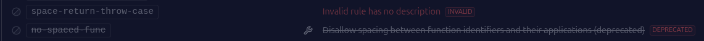
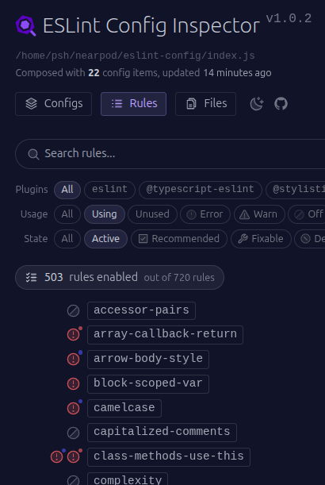
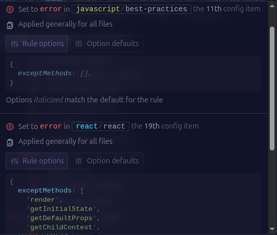
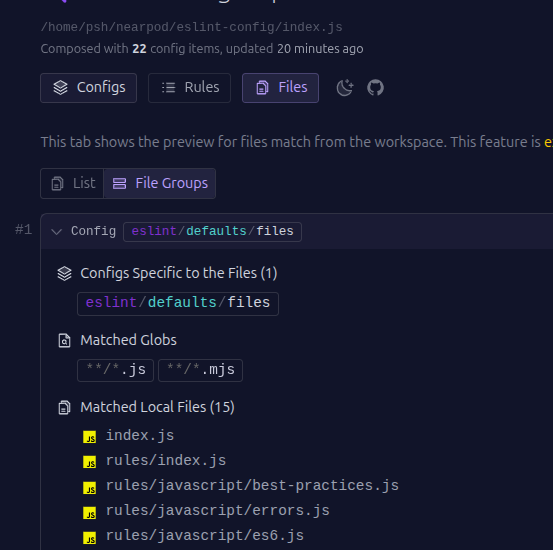

# Inspector

[ESLint Config Inspector](https://github.com/eslint/config-inspector) is a visual tool designed to inspect and understand ESLint flat configuration files.

## Configs

The first section displays all rule sets. For each set, you can see:

- The number of files matching the rules.
- The number of ignored files.
- The number of configurations, plugins, and rules loaded into the config file.

Examples:

- 2 matched files:  
  

- 2 ignored files:  
  

- 2 options:  
  

- 1 plugin and 48 rules:  
  

## Icons

Each rule has an icon indicating its severity level:

- Error:   
- Warning:   
- Off: 

If a circle appears above the icon, it means the rule has options configured:

- With options:  
   

- With a default option (blue circle):  
  

You can also identify whether a rule is invalid or deprecated:  

## Rules

This section lists all recognized rules. You can filter them by:

- Plugin
- Usage
- State

Additionally, it shows:

- How many times each rule is defined.
- In which files it appears.
- What options are set.  

## Files

Displays all files involved in the configuration:  

